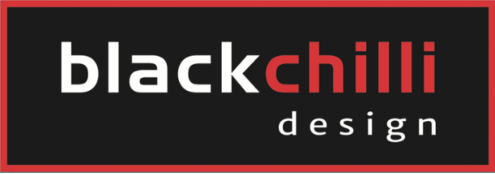
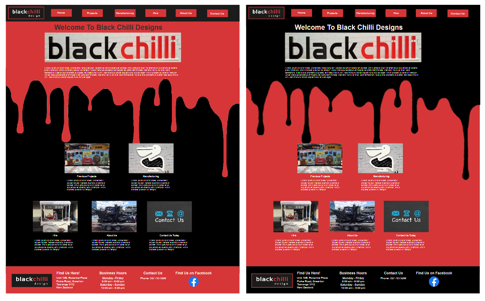
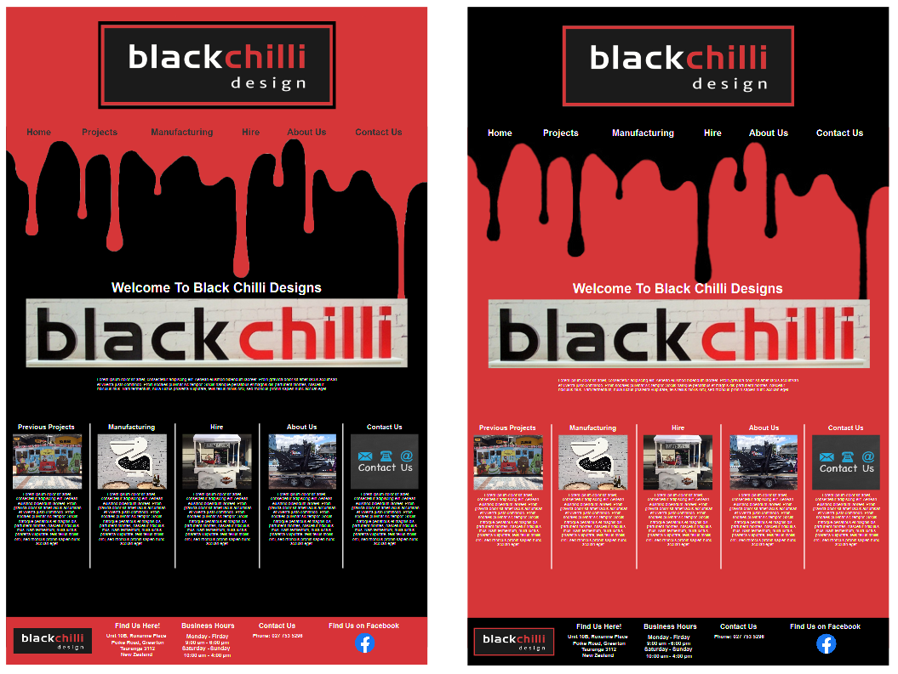
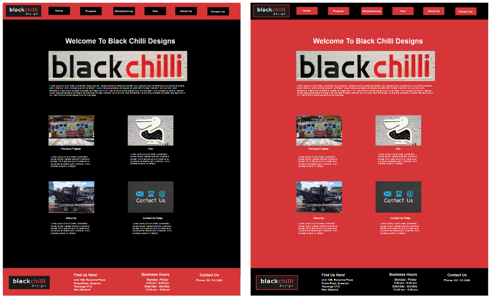

# Black Chilli Designs 
***

## Breif 
Black Chilli Designs is a local business in Tauranga and is my client for this assignment. The business design custom manufacturing and event hire company. The purpose of Black Chilli Design website is to bring customers to the business by showing previous projects that the company has taken part in, but also show just some of what Black Chilli Designs is capable of. Key requirements for the website is to ensure the content being advertised is clear and easy to see. The key message of the website is for customers to get in contact about design, manufacturing and hiring products as every project is different. 

***

## Research 
* __Examples similar to the website__
* __Key items to include in the site__
* __Special Requirements the client wants__ 
* __Current web design trends that can be applied to the site__

***

### Similar Websites 
__Research Results__ 
While looking at similar business websites, I saw a common trend, the simplisity of the layout. Everything is clearly layed out and easy to navigate through both websites. As a result, for the website I will keep the layout clear and more simple, as to keep the navigation of the website easy to use for customers. 
* (https://absolutepartyhire.co.nz/) - Absolute Party Hire  
* (https://bopeventhire.co.nz/) - BOP Event Hire 

***

### Key Items to Include 
* Images are good quality 
* Content is clear in the layout 
* Descriptions are clear and well presented with the images 
* Contact details are clear and easy to find

***

### Special Requirements 
* Content is well presented 
* Simple layout 
* Easy to navigate 
* Different information is clear 

***

## Current Web Design Trends 
The different website design trends that I found through research of trends that I saw relate to my research of similar websites to the my client's business. 
* Minimalistic  
* Bright Colours 
These are trends that I have tired to include in the design and layout of the website and the high fidelity wireframes. While the client will only choose one design, all three will include these trends. 

***

## Specifications 
* Website represents the brand (Black Chilli Designs) 
* Shows all services prior to ordering and consultations 
* Functionality - All links to other pages work cohesively
* Design - All the different webpages share same design 
* Layout of web pages are easy to navigate 
* Images and content are good quality 
* Information is clear and easy to find for customers

***

## Things needed for the layout 
* Content for the website 
* The colour scheme for the site itself 
* The clients requirements and what they imagine what their website would look like.
* Research of what the clients competition have for their websites. 

***

## Three High Fidelity Wireframes 
Based on findings of your research you are to produce three high fidelity wireframes from which your client will select one for the site. The wireframes should give an idea of layout, navigation, colours, font types and sizes and types and sized images used. 

From these high fidelity wireframes I decided to go with the layout and theme of second high fidelity wireframe as the layout works and its simple. 

Based on the second high fidelity wireframe is how the website is going to look through all the pages holding that same type of theme. 

***

## Progess Log 
Work through your product backlog, noting any major issues as you go. Use a format of your choice to record this.
Element | Issues | What does it do? | Works | Done 
--- | --- | --- | --- | ---
Background image | Was changing sizes when backgorund size was set to cover. | Covers part of the background seperating the different colours | Works | Done 
Image Sizes | Different Image resolutions | Advertise the different products of the website | Works | Done
Contact Form | No issues | Able to input information in email format to contact the company | Works | Done
Image Links | No issues | Click some images and get taken to different pages | Works | Done 
Navigation Links | No issues | Click on the navigation bar that takes the user to the different pages of the website | Works | Done
Website Responsiveness | Doesn't quite look correct in very small size | Allows the website layout to fit to both smaller and larger screen sizes | Works | Done

***

## Testing Table 
Test | Scenario | Expected Result | Actual Result | Pass/Fail
--- | --- | ---| --- | --- 
1 | Linked banner works from all pages | Sends user to home page when clicked | Sends user to home page | Pass
2 | Navigation buttons work | Buttons linked and send user to right pages | Sends user to correct pages as intended | Pass
3 | Linked Images work | When clicked sends user to correct page | Sends user to right page | Pass
4 | User able to find contact information | Use navigation bar or linked home page images to find contact us page | Contact Us information found | Pass 
5 | All images load correctly | Images load at good quality | Images are clear and load correctly | Pass 
6 | Find about us information | Using navigation or home page links to find about us information | About Us information found | Pass
7 | Layout is easy to read | Content is easy to read and navigate | Content is easy to read and navigate | Pass
8 | Test Responsiveness | Website is responsive to different size windows | Goes smaller or bigger with window size | Pass
9 | Google Maps Embedded | Goodle Maps embedded map works | Google Map shows correct location and street view | Pass 

